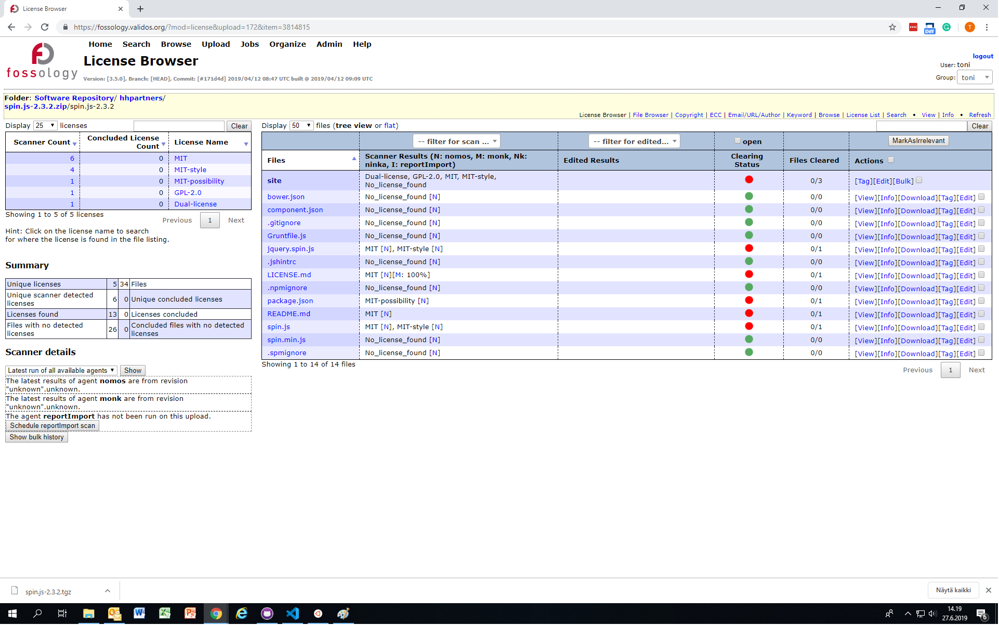

# Double Open Landscape Survey
| Version | Date |
|-------------|------------|
| Version 1 | 2019-02-15 |
| Version 1.5 | 2019-08-23 |

___

## Table of Contents
[Introduction](#introduction)

[Open Compliance Initiatives](#open-compliance-initiatives)
* [ClearlyDefined](#clearlydefined)
* [Eclipse Oscano](#eclipse-oscano)
* [Automated Compliance Tooling ACT](#automated-compliance-tooling-act)
* [OpenChain](#openchain)
* [Sharing-creates-value](#sharing-creates-value)

[FOSS tools](#foss-tools-for-open-source-compliance)
+ [Bang](#bang)
* [Fossology](#fossology)
* [ScanCode toolkit](#scancode-toolkit)
* [AboutCode toolkit](#aboutcode-toolkit)
* [Deltacode](#deltacode)
* [AboutCode Manager](#aboutcode-manager)
* [TraceCode toolkit](#tracecode-toolkit)
* [OSS Discovery by OpenLogic](#oss-discovery-by-openlogic)
* [Licensee.js](#licenseejs)
* [Ninka](#ninka)
* [Eclipse SW360](#eclipse-sw360)
* [Eclipse SW360antenna](#eclipse-sw360antenna)
* [OSS Review Toolkit ORT](#oss-review-toolkit-ort)
* [license-compatibility-checker](#license-compatibility-checker)
* [The Quartermaster Project QMSTR](#the-quartermaster-project-qmstr)
* [Open Source License Checklists by OSADL](#open-source-license-checklists-by-osadl)
* [Apache Rat](#apache-rat)
* [Apache Tentacles](#apache-tentacles)
* [Apache Whisker](#apache-whisker)
* [Cregit](#cregit)
* [OSS Attribution Builder](#oss-attribution-builder)
* [OSSPolice](#osspolice)
* [CLIPol](#cippic-licensing-information-project-for-open-licences-clipol)
* [Tern](#tern)
* [SPDX Tools](#spdx-tools)
* [SPDX Maven Plugin](#spdx-maven-plugin)
* [Reuse Software](#reuse-software)

[Uncategorized FOSS resources](#uncategorized-foss-resources)
* [Software Heritage](#software-heritage)
* [Debian Sources](#debian-sources)
* [mgmtconfig](#mgmtconfig)

[Commercial Tools](#commercial-tools-for-open-source-compliance)

[Development Tooling and Technologies](#development-tooling-and-technologies)
* [Request and Incident Management](#request-and-incident-management)
* [Integrated Development Environments](#integrated-development-environments)
* [Source Code Management and SCM Services](#source-code-management-and-scm-services)
* [Continuous Integration and Deployment](#continuous-integration-and-deployment)
* [Build Tools, Frameworks and Dependency Management](#build-tools-frameworks-and-dependency-management)
* [Package Indexes and Repositories](#package-indexes-and-repositories)
* [Document Management](#document-management)
* [Testing Frameworks](#testing-frameworks)
* [Container Technologies](#container-technologies)

[SPDX Implementation](#spdx-Implementation)
* [ScanCode-process](#scancode-process)
* [Fossology-process](#fossology-process)
* [Material on how the tools work](#material-on-how-the-tools-work)

[Double Open Short Ecosystem Survey 2019](#double-open-short-ecosystem-survey-2019)

[Voice-of-Customer Workshops 2019](#voice-of-customer-workshops-2019)

---

## Introduction

Open source software has eaten the world, but organizations are still struggling with effective compliance. Open source software is heterogenous and re-used, which, while positive for software development, creates a challenge for compliance. Compliance requires multiple tools and these should be ideally combined into a workflow that supports a number of business and developer requirements. One of the requirements is ease of use in a modern development environment where code development cycles are getting ever shorter and new development results are pushed to operations ever faster. For this to work, open source compliance tools likely need to integrate with development tooling.

In the following report some of these tools are listed with information of their main license, website and a summary of their features, based on accounts by the projects. The report has been crafted to map out the wide range of open source tools that one might use to help keep their open source software compliant. However, this report, ever so comprehensive, is not exhaustive. The report includes FOSS tools as well as a few commercial tools. It also has a section for Open Source Initiatives and Development Environments, as these are  also important on a way towards automated open compliance with open tooling and open data. 

This report will be complemented based on an ecosystem survey and on practical testing of the most popular open source tools.

This report is part of the first work package in the Double Open project. See [doubleopen.org](https://doubleopen.org) for more details.

---

## Open Compliance Initiatives

### ClearlyDefined
#### Website

[ClearlyDefined.io](https://clearlydefined.io/)

ClearlyDefined on [GitHub](https://github.com/clearlydefined/clearlydefined)

#### Summary

ClearlyDefined is a community / contributor powered project in which the goals are: 
1. Raise awareness about lack of clarity around licenses and security vulnerabilities within FOSS project teams
2. Automatically harvest data from projects
3. Make it easy for anyone to contribute missing information
4. Crowd-source the curation of these contributions
5. Feed curated contributions back to the original projects

ClearlyDefined provides a mechanism for harvesting available data using tools such as ScanCode and FOSSology, and facilitates crowd-sourcing the curation of that information when ambiguities or gaps arise. The ultimate goal of harvesting and curation is to contribute any new-found clarity (e.g., new licenses found) to the upstream projects so they can include the updates in their next release. The project focuses now on clarifying individual project's license, source code location and copyright holders, but do see security, accessibility, and internationalization being important parts of the ClearlyDefined ecosystem.

### Eclipse Oscano
#### Website

[Eclipse Oscano](https://projects.eclipse.org/proposals/eclipse-oscano)

#### Summary

The mission of the Oscano project is to solve the problem of scaling SCA to modern needs with Open Source approach. The Eclipse Oscano project provides a complete software composition analysis solution, focused on compliance and security, that can be installed on cloud, local server, or workstation environment. To achieve this, existing OSS components will be reviewed by the project team for possible integration into the Oscano stack and capabilities not existing will be built and integrated. Main use cases of Oscano include Open Source license compliance management, open source inventory management, vulnerability remediation automation and software analysis reporting. 

The solution is designed to meet the challenge of massively increasing scale and continuous nature of build and releasing of modern software systems. It addresses the scaling problem through four principal means: 

1. Continuous and fully automated operation cycle from new code commit to analysis, scan and action 
2. Maximum engagement of developers in the software analysis and management use cases for direct and early troubleshooting 
3. Risk-based smart analysis of compliance and vulnerability issues 
4. Maximum re-use of pre-scanned open source software data.

### Automated Compliance Tooling ACT
#### Website
[ACT](https://www.linuxfoundation.org/press-release/2018/12/the-linux-foundation-to-launch-new-tooling-project-to-improve-open-source-compliance/)

#### Summary
ACT is a Linux Foundation project. The goal is to consolidate investment in, and increase interoperability and usability of, open source compliance tooling, which helps organizations manage compliance obligations. ACT also welcomes two new projects to be hosted at The Linux Foundation as part of the initiative, in addition to two existing Linux Foundation projects that will become part of the new project. The new projects are complementary to existing Linux Foundation compliance projects such as OpenChain, which identifies key recommended processes to make open source license compliance simpler and more consistent, and the Open Compliance Program, which educates and helps developers and companies understand their license requirements and how to build efficient, frictionless and often automated processes to support compliance.

The four projects that will be part of ACT are:
* FOSSology
* QMSTR
* SPDX Tools
* Tern

### OpenChain
#### Website
[OpenChain](https://www.openchainproject.org/)

#### Summary
OpenChain is a project hosted by the Linux Foundation. It answers a question: "How do I trust my open source supply chain"? It provides a framework for shared, compliant use of FOSS. Conforming companies create an environment that supports use of FOSS internally and sharing of FOSS with partners. The [OpenChain Specification](https://www.openchainproject.org/spec) defines a core set of requirements every quality compliance program must satisfy. [OpenChain Conformance](https://www.openchainproject.org/conformance) allows organizations to display their adherence to these requirements. The [OpenChain Curriculum](https://www.openchainproject.org/curriculum) supports this process by providing extensive reference material for effective open source training and management. The result is that open source license compliance becomes more predictable, understandable and efficient for all participants in the software supply chain.

### Sharing-creates-value
#### Website
[Sharing-creates-value](https://github.com/Open-Source-Compliance/Sharing-creates-value)

#### Summary
This is GitHub repository hosted by Siemens. Sharing creates value strives for the goal to lower the required effort in license compliance work for all who want to make use of OSS in a license compliant way. To achieve this Sharing creates value will develop, share and improve the artifacts needed to fulfill the requirements of the different Free and Open Source Software licenses by applying the Open Source Software development principles.

Another objective of Sharing creates value is a very close collaboration with the OSS community in order to fix detected "bugs" in licensing as well as introducing the information needed for license compliance activities in the Open Source projects, i.e. provide our analysis work to the OSS projects.

Last but not least Sharing creates value support tools which will help automate and reduce effort in component management, license identification and OSS license compliance activities.

Sharing creates value wants to be the platform, which provides all information and artifacts for OSS license compliance.

---

## FOSS tools for open source compliance

### Bang
#### Website
[Bang](https://github.com/armijnhemel/binaryanalysis-ng)
#### Main License
[AGPL-3.0](https://www.gnu.org/licenses/agpl-3.0.txt)
#### Summary
Binary Analysis Next Generation, or BANG, is a tool for analyzing binary files. Currently its main goal is to very quickly find out the contents of binary files, such as firmware updates, and making information extracted from the contents available for further analysis, such as license compliance, security research or composition analysis. It has support for around 130 different file formats, which can be detected, unpacked and labeled.

### Fossology
#### Website
[Fossology](https://www.fossology.org/ )
#### Main License
[GPL-2.0](https://www.gnu.org/licenses/old-licenses/gpl-2.0.html)
#### Summary
Fossology is a scanning tool for license, copyright and export control scans. In one click you can generate an SPDX file, or a ReadMe with all the copyrights notices from your software. It provides a Web UI and a database for a compliance workflow. To scan, a package must be uploaded to the server. Scanners provided are Monk, Nomos and Ninka. It has version control on packages scanned, so when scanning a newer version of a previous package, only changed files are rescanned.

### ScanCode toolkit
#### Website
[ScanCode](https://www.aboutcode.org/ )
#### Main License
[Apache-2.0](https://www.apache.org/licenses/LICENSE-2.0)
#### Summary
ScanCode is a suite of command line utilities to reliably scan a codebase for license, copyright, package manifests and direct dependencies and other interesting origin and licensing information discovered in source and binary code files. ScanCode provides comprehensive scan results that you can save as JSON, HTML, CSV or SPDX. As a command line application returning JSON, ScanCode is easy to integrate in a code analysis pipeline and CI/CD.

### AboutCode toolkit
#### Website
[AboutCode](https://www.aboutcode.org/ )
#### Main License
[Apache-2.0](https://www.apache.org/licenses/LICENSE-2.0)
#### Summary
The AboutCode Toolkit and ABOUT files provide a simple way to document the origin, license, usage and other important or interesting information about third-party software components that you use in your project. In addition, this tool is able to generate attribution notices and identify redistributable source code used in your project.

### Deltacode
#### Website
[AboutCode](https://www.aboutcode.org/ )
#### Main License
[Apache-2.0](https://www.apache.org/licenses/LICENSE-2.0)
#### Summary
DeltaCode allows you to easily compare ScanCode scans for two versions of a package, component, codebase or product in order to quickly identify possible changes with a focus on identifying license changes. DeltaCode reports matching files with a score and a list of factors that contribute to that score. 

You can use DeltaCode with ScanCode to identify and track license and related changes in open source or third party software packages or components from release to release. 

### AboutCode Manager
#### Website
[AboutCode](https://www.aboutcode.org/ )
#### Main License
[Apache-2.0](https://www.apache.org/licenses/LICENSE-2.0)
#### Summary
AboutCode Manager provides an advanced visual UI to help you quickly evaluate license and other notices identified by ScanCode and record your conclusion about the effective license(s) for a component. 

AboutCode Manager is based on Electron and is the primary desktop/GUI tool for using nexB’s AboutCode tools.

### TraceCode toolkit
#### Website
[AboutCode](https://www.aboutcode.org/ )
#### Main License
[Apache-2.0](https://www.apache.org/licenses/LICENSE-2.0)
#### Summary
TraceCode Toolkit helps you determine which components are actually distributed or deployed for your product. This is essential information for determining your open source license obligations because many are only triggered by distribution or deployment. 

TraceCode Toolkit is a tool to analyze the traced execution of a build, so you can learn which files are built into binaries and ultimately deployed in your distributed software.

### OSS Discovery by OpenLogic
#### Website
[OSS Discovery](http://ossdiscovery.sourceforge.net/)
#### Main License
[GPL-3.0](https://www.gnu.org/licenses/gpl-3.0.html)
#### Summary
OSS Discovery finds the open source software embedded in applications and installed on computers. It is a scanning tool, which gives human readable and machine readable results.

### Licensee.js
#### Website
[Licensee.js](https://github.com/jslicense/licensee.js)
#### Main License
[Apache-2.0](https://www.apache.org/licenses/LICENSE-2.0)
#### Summary
Licensee.js is a command line utility to check npm package dependency license metadata against rules. It uses SPDX license expression and whitelisted data to capture packages that are under different license than whitelisted.

### Ninka
#### Website
[Ninka](http://ninka.turingmachine.org/)
#### Main License
[GPL-2.0](https://www.gnu.org/licenses/old-licenses/gpl-2.0.html)
#### Summary
Ninka is a lightweight license identification tool for source code. It is sentence-based, and provides a simple way to identify open source licenses in a source code file. It is capable of identifying several dozen different licenses (and their variations).

### Eclipse SW360
#### Website
[Eclipse SW360](https://projects.eclipse.org/projects/technology.sw360)
#### Main License
[EPL-1.0](https://www.eclipse.org/org/documents/epl-v10.php)
#### Summary
A software catalogue application designed to provide a central place for sharing information about software components used by an organization. It is designed to neatly integrate into existing infrastructures related to the management of software artifacts and projects by providing separate backend services for distinct tasks and a set of portlets to access these services. It has connectors to interact with external systems such as code scan tools. Thus far the project has not provided download information.

### Eclipse SW360antenna
#### Website
[Eclipse SW360](https://projects.eclipse.org/projects/technology.sw360.antenna)
#### Main License
[EPL-2.0](https://www.eclipse.org/legal/epl-2.0/)
#### Summary
Eclipse SW360antenna is a tool to automate your open source license compliance processes as much as possible. In the end that is
* collecting all compliance relevant data,
* process that data and warn if there might be any license compliance related issues, and
* generating a set of compliance artifacts (source code bundle, disclosure document, report)

for your project.

### OSS Review Toolkit ORT
#### Website
[ORT](https://github.com/heremaps/oss-review-toolkit)
#### Main License
[Apache-2.0](https://www.apache.org/licenses/LICENSE-2.0)
#### Summary
Verifies free and open source software license compliance by checking source code and dependencies. It works by analyzing the source code for dependencies, downloading the source code of the dependencies, scanning all source code for license information, and summarizing the results. The different tools that make up ORT are designed as libraries (for programmatic use) with a minimal command line interface (for scripted use). Currently the report formats are Excel sheet, NOTICE file, static HTML and Web App. 

### license-compatibility-checker
#### Website
[license-compatibility-checker](https://github.com/HansHammel/license-compatibility-checker#readme)
#### Main License
[MIT](https://opensource.org/licenses/MIT)
#### Summary
Check npm dependencies' package.json for license compatibility based on SPDX standards. Claimed to be a work in progress, but gives a simple comparison of the licenses in the package with an explanation to how permissive the license is (Permissive > Weakly Protective > Strongly Protective > Network Protective). Shows potential incompatibilities with a colorful scheme.

### The Quartermaster Project QMSTR
#### Website
[QMSTR](https://qmstr.org/)
#### Main License
[GPL-3.0](https://www.gnu.org/licenses/gpl-3.0.html)
#### Summary
Quartermaster is a suite of command line tools and build system extensions that instruments software builds to create FOSS compliance documentation and support compliance decisions. Quartermaster runs adjacent to a software build process. A master process collects information about the software that is build. Once the build is complete, the master executes a number of analysis tools, and finally a number of reporters. All modules are executed in the context of the master, not the build machine. The master ships all dependencies of the modules without affecting the build clients file system (it runs in a container).

### Open Source License Checklists by OSADL
#### Website
[Open Source License Checklists](https://www.osadl.org/Open-Source-License-Checklists.oss-compliance-lists.0.html)
#### Main License
Unidentified
#### Summary
A project to create and disseminate generally accepted rules to fulfill the obligations when distributing software that is licensed under commonly used Open Source licenses. The goal of this project is to create checklists for the most frequently used and the most important Open Source licenses and to provide assistance tools for the determination of differences between them. 

### Apache Rat
#### Website
http://creadur.apache.org/rat/
#### Main License
[Apache-2.0](https://www.apache.org/licenses/LICENSE-2.0)
#### Summary
Apache Rat is a release audit tool, focused on licenses. Coded in Java, it runs from the command line with plugins for Maven and Ant. Rat is extensible. It is part of the Apache Creadur project.

### Apache Tentacles
#### Website
[Apache Tentacles](http://creadur.apache.org/tentacles/)
#### Main License
[Apache-2.0](https://www.apache.org/licenses/LICENSE-2.0)
#### Summary
Apache Tentacles helps the reviewer by automating interactions with the repository containing the artifacts comprising the release. Apache Tentacles simplifies the job of reviewing repository releases consisting of large numbers of artifacts. Coded in Java, it runs from the command line.

### Apache Whisker
#### Website
[Apache Whisker](http://creadur.apache.org/whisker/)
#### Main License
[Apache-2.0](https://www.apache.org/licenses/LICENSE-2.0)
#### Summary
Apache Whisker assists assembled applications maintain correct legal documentation.

Whisker can 
* verify - checking meta-data quality against a distribution
* generate - legal documents from meta-data

Particular useful for complex assembled applications.

### Cregit
#### Website
[Cregit](https://github.com/cregit/cregit)
#### Main License
[GPL-3.0](https://www.gnu.org/licenses/gpl-3.0.html)
#### Summary
Cregit identifies the contributors of source code. The cregit version of a source file has two interactive features:
* Mouse-over: you will get a summary of the information of the commit that added this token. This information is:
    * Its commit id
    * Its git-author (the value of the Author field of the commit)
    * Its git-author-date (the value of the field Author Date of the commit)
    * Summary log of the commit
* Left-click on a token will open a new window with the details of the commit (in github). You can keep this window open and it will keep reloading the files.

### OSS Attribution Builder
#### Website
[OSS Attribution Builder](https://github.com/amzn/oss-attribution-builder)
#### Main License
[Apache-2.0](https://www.apache.org/licenses/LICENSE-2.0)
#### Summary
OSS Attribution Builder is a website that helps teams create attribution documents for software products. 

### OSSPolice
#### Website
[OSSPolice](https://github.com/osssanitizer/osspolice)
#### Main License
[GPL-3.0](https://www.gnu.org/licenses/gpl-3.0.html)
#### Summary
OSSPolice is a risk assessment service for developers that can quickly identify potential free software license violations and known n-day security vulnerabilities in their apps. 

### CIPPIC Licensing Information Project for Open Licences CLIPol
#### Website
[CLIPol](http://www.clipol.org/)   
As of 03.06.2019 the website is down. An inqury has been made on whether the project is maintained or not.   
#### Main License
[BSD-2-Clause](https://opensource.org/licenses/BSD-2-Clause)
#### Summary
CLIPol is a web platform, maintained by the Samuelson-Glushko Canadian Internet Policy and Public Interest Clinic, a public interest technology law clinic at the Faculty of Law, Common Law Section, University of Ottawa, designed to serve useful information about open data licences, open content licences, and open source software. It consists of:
* a database of machine-readable information on the rights, restrictions and obligations in different licences;
* an API for retrieving this information;
* a web-accessible site for viewing this information in a user-friendly way (avoiding legalese); and
* a set of web apps built on top of this information (currently consisting of a compatibility-checking tool and a text-comparison tool).

### Tern
#### Website
[Tern](https://github.com/vmware/tern)
#### Main License
[BSD-2-Clause](https://opensource.org/licenses/BSD-2-Clause)
#### Summary
Tern is a software package inspection tool for containers written in Python. Tern is an inspection tool to find the metadata of the packages installed in a container image. It does this in two steps:
1. It uses overlayfs to mount the first filesystem layer in a container image
2. It then executes scripts from the "command library" in a chroot environment to collect information about packages installed in that layer
3. With that information as a base, it continues to iterate over step 1 and 2 for the rest of the layers in the container image
4. Once done, it generates a report in different formats. The default report is a verbose explanation of what layers brought in what software components. If a Dockerfile is provided then it will also provide what lines in the Dockerfile was used to create the layers.

### SPDX Tools
#### Website
[SPDX Tools](https://spdx.org/tools)
#### Main License
[Apache-2.0](https://www.apache.org/licenses/LICENSE-2.0.txt)
#### Summary
The consolidated SPDX workgroup tool provides translation, comparison, and verification functionality in a single download. The tool is a Java command line utility.

The following functions are available:

* TagToSpreadsheet - Convert a tag format input file to a spreadsheet output file
* TagToRDF - Convert a tag format input file to an RDF format output file
* RdfToTag - Convert an RDF format input file to a tag format output file
* RdfToHtml - Convert an RDF format input file to an HTML web page output file
* RdfToSpreadsheet - Convert an RDF format input file to a spreadsheeet format output file
* SpreadsheetToRDF - Convert a spreadsheet input file to an RDF format output file
* SpreadsheetToTag - Convert a spreadsheet input file to a tag format output file
* SPDXViewer - Display an SPDX document input file (in either tag/value or RDF format)
* CompareMultipleSpdxDocs - Compare multiple SPDX documents (in either tag/value or RDF formats) and output to a spreadsheet
* CompareSpdxDocs - Compare two SPDX documents (in either tag/value or RDF format)
* GenerateVerificationCode - Geneinkrate a Verification Code from a directory of files.

### SPDX Maven Plugin
#### Website
[SPDX Maven Plugin](https://github.com/spdx/spdx-maven-plugin)
#### Main License
[Apache-2.0](https://www.apache.org/licenses/LICENSE-2.0.txt)
#### Summary
SPDX Maven Plugin is a plugin to Maven which produces Software Package Data Exchange (SPDX) documents for artifacts described in the POM file. 

### REUSE Software
#### Website
[REUSE SOFTWARE](https://reuse.software/)
#### Main License
[CC-BY-SA-4.0](https://creativecommons.org/licenses/by-sa/4.0/legalcode)
#### Summary
REUSE initiative is an initiative to provide a set of recommendations to make licensing your free software projects easier. REUSE has tools that facilitate the developer in complying with the said recommendations. REUSE is an initiative of the FSFE and uses SPDX as their standard practice. It requires user to add 1) the exact text of the license, 2) a copyright notice and license header to every file 3) an inventory for included software.  

---

## Uncategorized FOSS resources
To be possibly categorized elsewhere.
### Software Heritage
#### Website
[Software Heritage](https://www.softwareheritage.org/)
#### Summary
Software Heritage collects and preserves software in source code form. "Software embodies our technical and scientific knowledge and humanity cannot afford the risk of losing it." They currently have (18 Feb 2019) some 88 Million projects archived.

### Debian Sources
#### Website
[Debian Sources](https://sources.debian.org/)
#### Summary
A source code package repository for debian sources. They also provide an API delivering JSON objects.

### mgmtconfig
#### Website
[mgmtconfig](https://github.com/purpleidea/mgmt/)
#### Summary
From GitHub pages: Next generation distributed, event-driven, parallel config management.

------------------------------------------------------

## Commercial Tools for Open Source Compliance
For the purposes of the project and this survey, evaluation made on commercial open source tools is largely based on listing known tools. Some evaluation and grouping has been made regarding the advertised amount of specified integrations. All seem to offer a REST API to be used for further integrations. In addition to integrations, security vulnerability scanning seems to be a part of these offerings, either as a product feature or a sister product. The information has been gathered from the respective websites of every commercial tool provider.

**Extensive integrations (over 15 advertised integrations)**  

[Flexera](https://www.flexera.com/)  
[BlackDuck by Synopsys](https://www.blackducksoftware.com/black-duck-home)  
[Fossa](https://fossa.com/)  
[WhiteSource](https://www.whitesourcesoftware.com/)  
[Nexus by Sonatype](https://www.sonatype.com/)  
[OpenLogic by Rogue Wave Software](https://www.roguewave.com/)  
[TrustSource](https://www.trustsource.io/)  

**Some integrations (5-15 advertised integrations)**  

[CAST Software Intelligence](https://www.castsoftware.com/)

**Few integrations (1-5 advertised integrations)** 

[Anchore](https://anchore.com/)

**Integrations not specified**

[TripleCheck](http://triplecheck.tech/)  
[DejaCode by NexB](https://www.nexb.com/index.html)  
[FOSSID](https://fossid.com/)  
[Insigniary](https://www.insignary.com/)  

## Development Tooling and Technologies

### Request and Incident Management
* Polarion
* Team Foundation Server
* JIRA
* Github/Gitlab/other Git service

### Integrated Development Environments

* Eclipse
* Visual Studio
* Qt Creator
* Netbeans IDE
* JetBrains CLion
* JetBrains GoLand
* JetBrains IntelliJ IDEA
* JetBrains PhpStorm
* JetBrains PyCharm
* JetBrains Rider
* JetBrains RubyMine
* JetBrains WebStorm
* Android Studio

### Source Code Management and SCM services 

* SVN
* Git
* GitLab
* Bitbucket
* GitHub

### Continuous Integration and Deployment

* Jenkins
* Team Foundation Server
* Bamboo
* TeamCity
* CircleCI
* Azure DevOps (ent. Team Services)
* Travis CI
* GitLab CI
* Concourse
* AWS CodeBuild
* Codeship
* Drone.io
* wercker
* Go.CD
* Semaphore
* Appveyor
* Buildkite
* Ansible
* Puppet

### Build Tools, Frameworks and Dependency Management

* Cmake
* Yocto / OpenEmbedded
* BitBake
* Visual Studio
* Apache Maven
* Gradle
* npm
* yarn
* pip / pipenv
* Conda
* Composer
* sbt
* Make
* Apache Ant
* Webpack

### Package Indexes and Repositories

* Go Search
* npm registry
* Packagist (the PHP Package Repository)
* Maven repositories
* PyPI (Python Package Index)
* RubyGems.org
* NuGet
* Bower
* CPAN
* Cargo (crates.io)
* "PEAR (PHP Extension and Application 
* Repository)"
* PlatformIO registry
* Nexus Repository
* JFrog Artifactory

### Document Management

* Flowdock
* Confluence

### Testing Frameworks

* Robot Framework
* Cypress
* RedwoodHQ
* Selenium
* Serenity
* Citrus Framework
* TestRail
* qTest

### Container Technologies

* Docker
* Cloud Foundry
* Atomic
* OpenShift
* Kubernetes

---

## SPDX Implementation 

**(SECTION UNDER WORK)**

One of the Double Open project's concerns for prospective concepts is the way data management is conducted. The question is, in what form should data be stored and distributed? In this section we reasearch the possibility of SPDX being the common data format. This format has not been challenged and has been widely accepted as the common format by the ecosystem. 

Establishing a common data format for the whole ecosystem allows resources to be allocated on license compliance. Therefore the data format should accurately communicate licensing information and it should make such information available in a consistent, understandable and re-usable way. When information is uniform with information disseminated by other actors in the field, this will reduce redundant work in determining software license information. 

Standard formats allow for tooling to be created for OSS compliance. The more accurate and less prone to interpretation the data format is the more meticulous, efficient and complex tools can be made around such formats. When researching for possible automation of OSS compliance, the requirements for tools advance in all respects especially when the precision of results presented by tools is under scrutiny. The only way to deduce the amount of false positives given by scanning tools e.g. Fossology, is to have a machine and human readable standard data format that has substantal adoption and acknowledgement of the ecosystem.

**What is SPDX?** SPDX or the Software Package Data Exchange, is an open standard for communicating software bill of material information (including components, licenses, copyrights and security references). It is an initiative hosted by Linux Foundation whose goal is to develop an open standrard format and supporting tools for communicating licenses and copyrights associated with software packages.

SPDX has developed several pieces of collateral to help solve compliance issues. They have issued the [SPDX License List](https://spdx.org/licenses/), [SPDX Specification](https://spdx.org/spdx-specification-21-web-version) and [Source Identifiers](https://spdx.org/ids) for code. 

**Implementation.** Based on the results of the Short Ecosystem Survey 2019, we have taken three tools/initiatives under scrutiny for this section. These three are: 
1. Fossology; 
2. ScanCode; and 
3. ClearlyDefined. 

### ScanCode-process

Scancode is a standalone command line tool written in Python to scan components for licensing information. It does a comparison between a database of license texts and the scanned component. The output of the results can be chosen between JSON, HTML, CSV or SPDX (tag/value and rdf). ScanCode can run on Linux, Mac and Windows. It has a plug in to make license policys. 

ScanCode is a widely integrated tool that can be found as a scanner, for example from OSS Review Toolkit ORT and ClearlyDefined. The use of the tool is normal for the general public and the reports it produces are familiar to many. However, unlike others, ScanCode does not extract files from packed files. This means, that a separate extractions process has to be made with the bundled utility extractcode or other (like unzip). 

The output file has an URL address to the home page, text, and the SPDX page of the license. In addition, the output displays the SPDX short identifier (described as spdx_license_key). ScanCode reads the copyrights more accurately and produces a cleaner outcome than e.g. Fossology, which usually distributes plenty of unnecessary information in connection with the copyright texts.

Unlike Fossology, ScanCode does not have an UI. This makes data curation errandous and slow. However the AboutCode Manager i.e. ScanCode Workbench is a great utility to assess the findings of a scancode scan in a .json format. 

### Fossology-process

Fossology is an open source license compliance software system and toolkit. In the making of this report, we ran fossology as a system through its database and web UI (workflow). It can also be run as a toolkit from command line to perfore license, copyright and export contol scans. This toolkit is also part of its workflow. 

Fossology generates SPDX files or a ReadMe file. It has a version control integrated named deduplication, in which you can scan an entire distro and rescan a newer version and only the changed files will go through rescanning. If scanning is done continuously e.g. when building software, this is a time saving feature. 

Fossology does have issues. For example it gives out -style license flags when licenses are similar but not 100 % equivalent with the original license text. This is not alined with the SPDX spexifications. With Monk (text scanner) and Nomos (regex scanner) scanning tools there is often two license hits within one file of which the other one is a -style license and the other one the original intended license. Fossology also gives imprecise copyright information. It is rather the abundance of information than the lack of, which is an issue in Fossology. This brings up false flags in copyrights and need elaborous cleaning if the curator wants to aggregate a clear endreport. From the perspective of legality regarding a notice file, this is a nonissue. As long as given information is valid and they are at their right spots, the notice creation is successful even though the end result is sloppy.

Where Fossology stands out compared to the competition is the capability to curate data straight on the web UI with ease. With every scanner there are definitely going to be red flags and otherwise false license findings. In Fossology the curator can conculde license findings straight on the UI and the UI informs the curator, which files are not yet curated. It gives curator an ability to bulk scan the curation curator has confirmed in other files to expedite the curation process. 

Fossologys value is in the easiness of curation process. There will always be issues that where the scanner itself cannot be trusted 100 % and it requires a human to go through them. At these moments the Fossology web UI curation workflow is invaluable. 

### Material on how the tools work

Package used: spin.js-2.3.2

**ScanCode full scan with an output file of .json.** 

**Picture showing what possible results does the ScanCode-Workbench i.e. AboutCode Manager show.**

**List of jobs Fossology goes through in the scanning process (Web UI).**

**The initial results of a Fossology scan.**

---

## Double Open Short Ecosystem Survey 2019

Double Open launched the Double Open Short Ecosystem Survey 2019 to accumulate real-life factual information from members of the open source ecosystem to investigate the existing landscape, and popularity of open source compliance tools and development tools/technologies as well as open source initiatives.

The response quantity (28) to the survey was small to medium. However, the purpose of the survey was to explore the potential direction of the software industry and open source compliance. By reaching out to several compliance-related communities, we achieved in getting answers from a group of persons within the industry who represent an interesting insight into the tooling used in and in relation to open source compliance. 61 per cent of the sample group was companies with over 1000 employees. Large companies are de facto influential in the OSS industry and also the ones with the most need for open source compliance. Therefore we deem the Survey to be an overall success and it does give valid information of e.g. integrations to all who wish to develop and contribute in open source. 

Results show, that the FOSS tools that are preferred by the whole ecosystem are Fossology, ScanCode and SPDX toolkit. These have existed for a long time and have established themselves as primary tools in OSS compliance. Besides, the tools have had the possibility to improve over time to better serve the people and organizations who use them. 

The tools that are mentioned above as the preferred tools of the ecosystem will be in our focus when we accrue information in our concept. For the full results and statistics of the Survey please go to [Ecosystem Survey 2019](/Ecosystem-Survey-2019).

## Voice-of-Customer Workshops 2019

The Voice-of-Customer workshops were carried out to understand the open source compliance operations of Validos members within their software development and maintenance processes. 

Workshops set out to define the current state and the dream state of the organizations. The results are to complement the development of the Double Open Concept. 

The outcome was two-fold. On one side there was a requirement for enterprises to get an efficient toolchain which automates OSS compliance during the build pipeline of the software. On the other side, there was a requirement for enterprises to efficiently develop the OSS compliance competence of their personnel. Both of the views should be addressed when researching issues and remedies regarding OSS compliance.

To sum up, we can see that the problems of OSS compliance within organizations fall into two categories. Firstly, compliance is overlooked for either the lack of a toolchain that could manage everything required for the software release to be compliant. At this point, compliance requires laborious and time-consuming manual work, which for many might seem as redundant compared to the risk involved. Secondly, compliance is overlooked due to lack of motivation (i.e. understanding the importance) or the lack of competence to assess compliance information.

Double Open project will research ways to amend the said issues. The research will be accrued into the concept design of Double Open. The envisioned final object would be to initiate a Proof of Concept of both issues separately.

For the full report please go to [Voice-of-Customer Workshops](/Voice-of-Customer-Workshops).